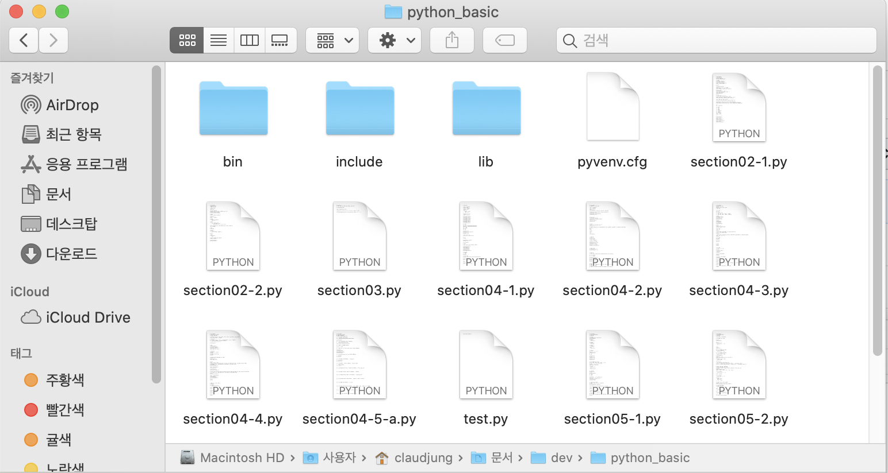
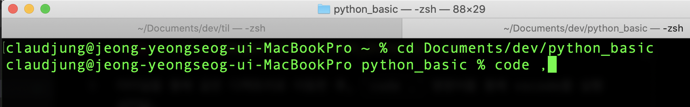
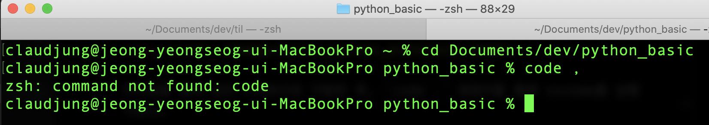
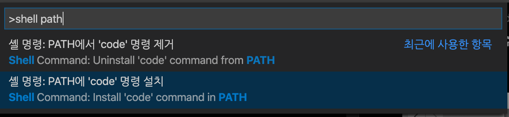
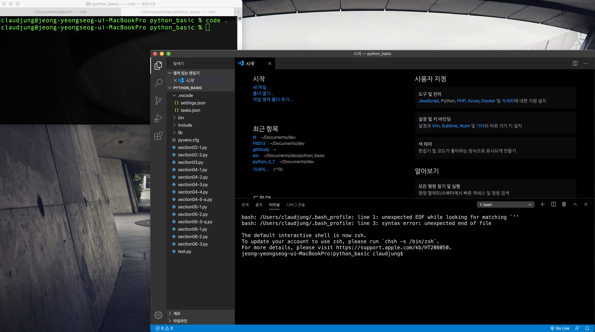

# 터미널 에서 VScode 실행 시키기

## # 난 평범하지 않아 ! 멋있게 터미널에서 vscode를 실행시키겠어 ! 🤟🏼

설치 된 VScode를 클릭하여 실행 시킬 수도 있지만 터미널을 통해 작업할 디렉토리에서 **`code .`** 를 통해 바로 VScode를 실행 시킬 수 있다.

먼저, 내가 작업할 폴더 python_basic은 다음과 같은 디렉토리에 있다.
  

터미널을 통해 같은 디렉토리로 이동한 후, `code .` 명령어를 통해 vscode를 실행 시킨다. 

이때, 정말 아무 문제없이 조용히 원하는 방향대로 실행이 된다면 너무나 좋겠지만  
언제나 이슈가 생기죠... 하하.. 😩

다음과 같이 `command not found: code` ...

---
  
### shell path 설치
vscode 명령팔레트에서 `shell path`를 설치하여 해결 할 수 있다.

shell path 설치 후, 터미널에서 `code .` 명령하면 vscode가 아름답게 실행되는 것을 볼 수 있다. 😆

위에서는 진담 반 장난 반으로 멋있게 터미널에서 vscode를 실행 시키겠다고 했지만, 실제로 vscode를 실행시켜서 작업파일 찾아 불러오기 보다는 터미널을 통해서 원하는 디렉토리에서 곧장 작업 할 수 있게 vscode를 실행 시키는게 보다 더 심플하고 빠르게 작업할 수 있는 것 같다. ( feat. 터미널 환경 익숙해지기 )

