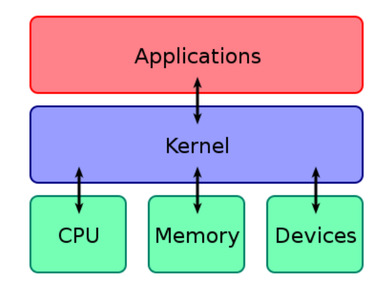

# shell , vim

## # Kernel
  `하드웨어와 응용프로그램` 을 이어주는 운영체제의 핵심 시스템소프트웨어  
  < 그림 이미지는 [최우영 님](https://github.com/ulgoon/essential-git) git & github 강의 자료 참고 >

  

## # Shell
  - 운영체제의 `커널과 사용자` 를 이어주는 소프트웨어
  - sh(Bourne Shell): AT&T Bell 연구소의 Steve Bourne이 작성한 유닉스 쉘
  - csh: 버클리의 Bill Joy가 작성한 유닉스 쉘(C언어랑 비슷한 모양)
  - bash(Bourne Again Shell): Brian Fox가 작성한 유닉스 쉘
    - 다양한 운영체제에서 기본 쉘로 채택
  - zsh: Paul Falstad가 작성한 유닉스 쉘
    - sh 확장형 쉘
    - 현재까지 가장 완벽한 쉘

>  MacOS Catalina 부터는 zsh이 기본 shell로 적용 되었다

<br>
<br>

### Shell 기본 명령어
```py
# 폴더(디렉토리) 이동
cd 

# 바로 상위 디렉토리 이동
cd ..

# 폴더(디렉토리) 생성
mkdir 

# 나열
ls

# 모두 나열 ( 숨김파일 )
ls -al

# 파일 생성
touch

# 파일 이동
mv (파일명) (이동할 디렉토리)

# 파일 이름 수정
mv (파일명) (현재 디렉토리)

# 파일 복사
cp (복사할 파일명) (복사할 위치 디렉토리)

# 파일 삭제
rm

# 디렉토리 삭제
rm -rf

```

### chmod 권한
파일의 권한을 설정할 때 사용한다.  
`ls -al` 로 파일들의 권한들을 확인할 수 있다. 
```
claudjung@jeong-yeongseog-ui-MacBookPro chmod-test % ls -al
total 0
drwxr-xr-x  4 claudjung  staff  128  5  5 13:05 .
drwxr-xr-x  5 claudjung  staff  160  5  5 13:04 ..
-rw-r--r--  1 claudjung  staff    0  5  5 13:04 READM.md
drwxr-xr-x  2 claudjung  staff   64  5  5 13:05 push
claudjung@jeong-yeongseog-ui-MacBookPro chmod-test % 
```
`drwxr-xr-x`  
`d` or `-` : directory or file  
rwxr-xr-x  
(user)(group)(other)의 권한   
3줄씩 3개 총 9자리  
`r` : 읽기  
`w` : 쓰기  
`x` : 실행  
`-` : 권한 없음  

```
% chmod [옵션](8진수) (파일명)
```
8진수  
0: 000  
1: 001  
2: 010  
3: 011  
4: 100  
5: 101  
6: 110  
7: 111

README 파일은 현재 `-rw-r--r--`  
형태: 파일  
(user): 읽기, 쓰기   
(group): 읽기  
(other): 읽기  

모든 권한을 주려면 (user)(group)(other)가 모두 (111)(111)(111) 이어야 하므로
```
claudjung@jeong-yeongseog-ui-MacBookPro chmod-test % chmod 777 READM.md 
claudjung@jeong-yeongseog-ui-MacBookPro chmod-test % ls -al
total 0
drwxr-xr-x  4 claudjung  staff  128  5  5 13:05 .
drwxr-xr-x  5 claudjung  staff  160  5  5 13:04 ..
-rwxrwxrwx  1 claudjung  staff    0  5  5 13:04 READM.md
drwxr-xr-x  2 claudjung  staff   64  5  5 13:05 push
claudjung@jeong-yeongseog-ui-MacBookPro chmod-test % 
```


