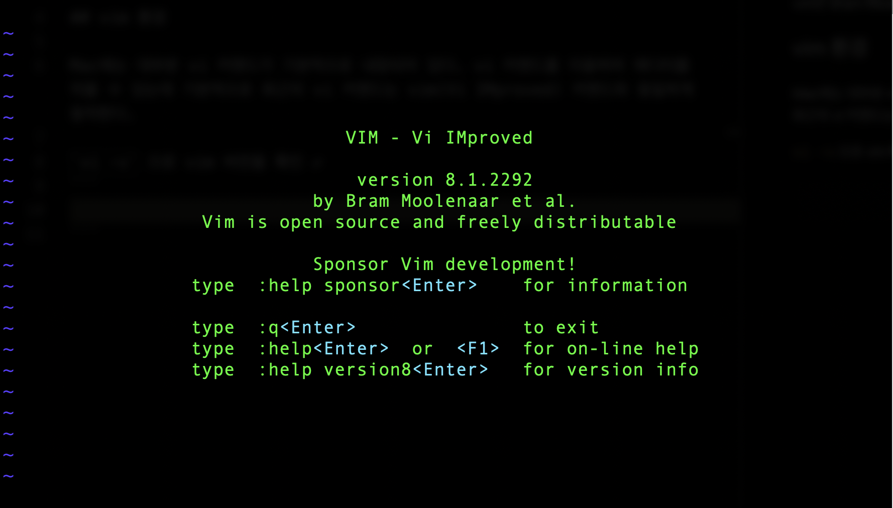
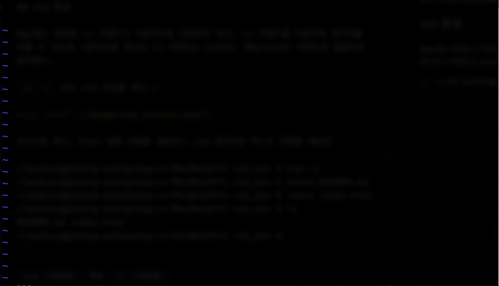
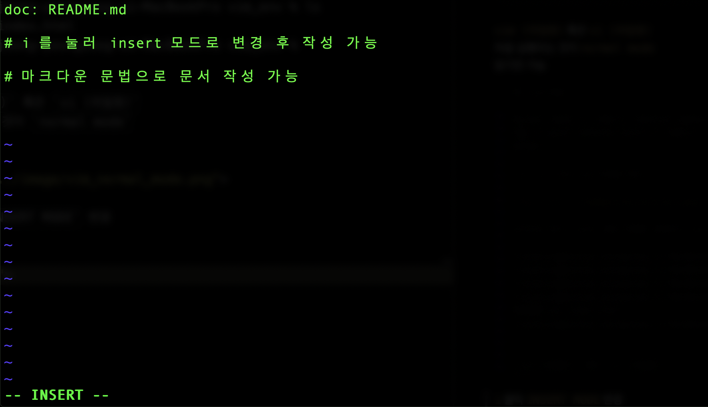
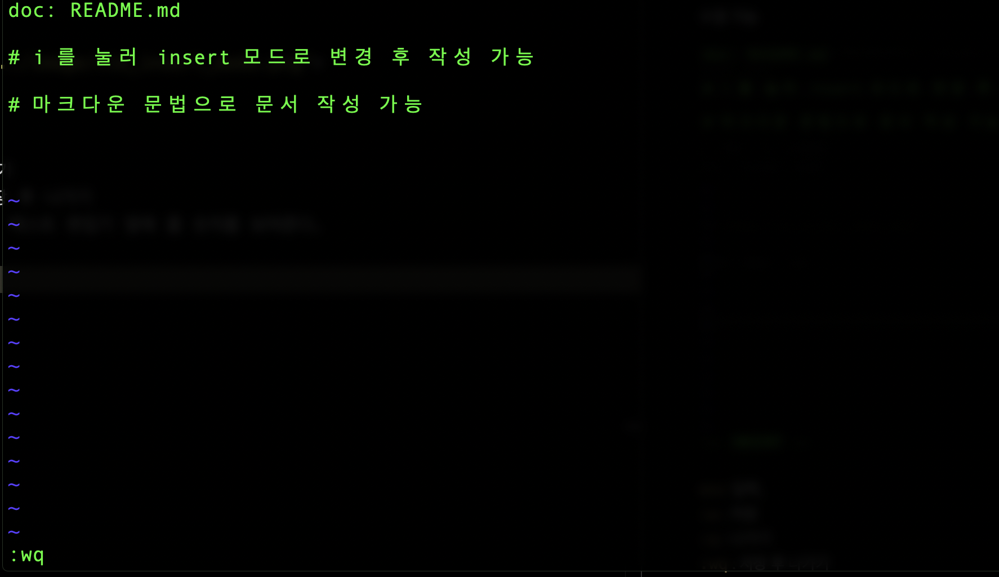

# vim
vim은 Bram Moolenaar가 만든 vi 호환 `텍스트 편집기`  

## # vim 환경

Mac에는 대부분 vi 커맨드가 기본적으로 내장되어 있다. vi 커맨드를 이용하여 에디터를 띄울 수 있는데 기본적으로 최근의 vi 커맨드는 vim(Vi IMproved) 커맨드와 동일하게 동작한다.  
마크다운, html 등등 텍스트 기반 파일들을 텍스트 편집 할 수 있다.

`vi -v` 으로 vim 버전을 확인 ✔️



마크다운 문서, html 등등 파일을 생성하고 vim 에디터로 텍스트 작업을 해보면
```
claudjung@jeong-yeongseog-ui-MacBookPro vim_env % vim -v
claudjung@jeong-yeongseog-ui-MacBookPro vim_env % touch README.md
claudjung@jeong-yeongseog-ui-MacBookPro vim_env % touch index.html
claudjung@jeong-yeongseog-ui-MacBookPro vim_env % ls
README.md	index.html
claudjung@jeong-yeongseog-ui-MacBookPro vim_env % 
```

`vim (파일명)` 혹은 `vi (파일명)`  
처음 실행되는 것이 `normal mode`  
읽기만 가능



`i` 클릭 `INSERT MODE` 변경  
수정 가능  



`esc` 입력,  
`:w` : 저장  
`:wq` : 저장 후 나가기  
`:q` : 나가기  
`:qa` : 저장 하지 않고 나가기   
`:set nu`: 텍스트 편집기 옆에 줄 숫자를 보여준다.  



## # 끝으로
vim을 처음 사용해보기 때문에 기본적인 읽기, 쓰기 용으로 정리를 해보았다.  
현재는 CLI 환경에서 vim을 사용하여 특히 git 커밋할 때 등등 활용하면서 익숙해지고  
나중에 테마적용, 여러가지 명령어 등을 사용하면서 정리를 추가적으로 해야겠다.