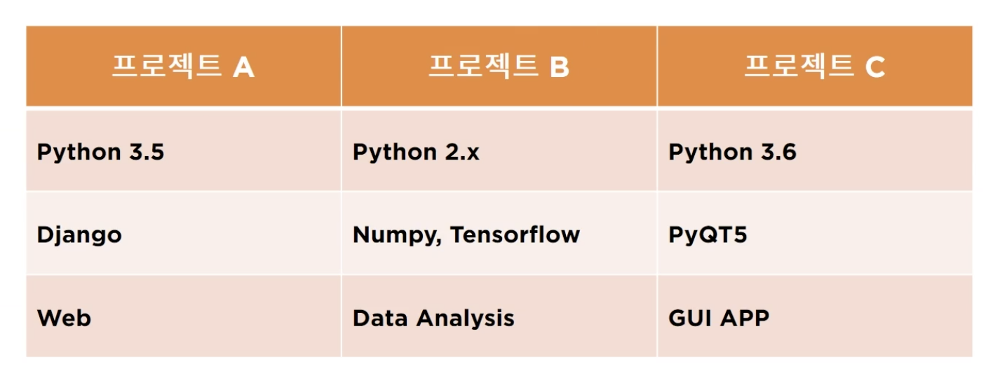
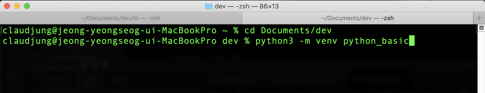
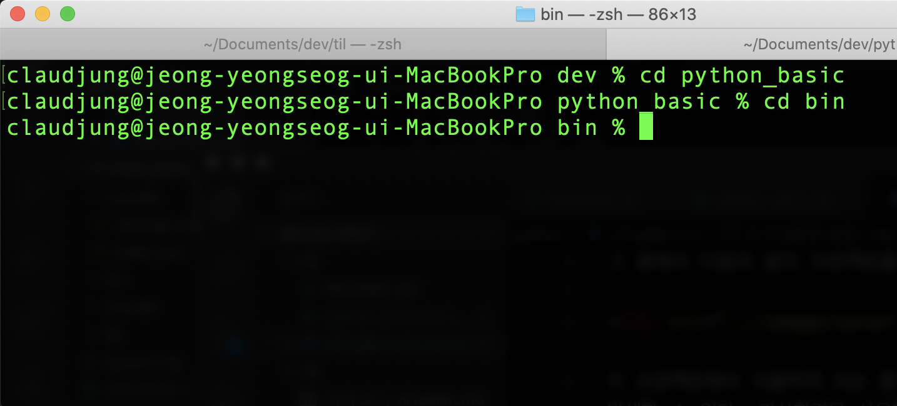
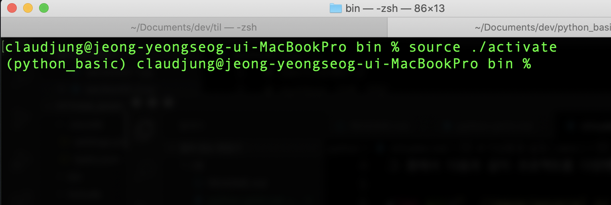
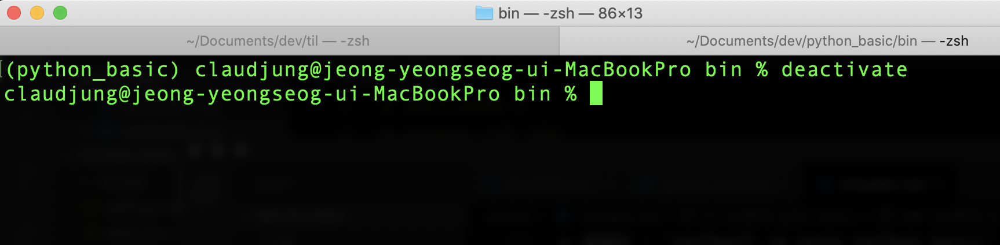

# 가상환경 설정 ( venv )

폴더 내에 가상환경을 실행시켜서 작업을 하는 것에는 많은 이점이 있다.  
그 중에서 다음과 같이 프로젝트를 다양한 환경으로 진행하는 경우  

각 프로젝트에서 사용하게 되는 환경을 제대로 파악하지 못해 다양한 이슈 등이 발생할 수 있다. 가상환경을 사용할 경우, 각각의 프로젝트가 사용할 것들을 각각 환경에서 관리 할 수 있고, 하나의 프로젝트가 끝났을 경우 그 프로젝트 가상환경만 삭제해주면 관리도 편리해진다.

## 가상환경 만들기

### vevn로 가상환경 폴더 생성
터미널에서 생성할 디렉토리로 이동 후,  
python3 환경에 python_basic 의 제목으로 가상환경 폴더를 생성하기 위해 다음과 같은 명령어를 입력한다.  
> 명령어 : `python3 -m venv python_basic`

### 가상환경 활성화 ( activate ) 

python_basic 폴더 내에 `bin`, `lib`, `include` 중 `bin` 폴더로 이동한다.

  
> 명령어 : `source ./activate` 로 가상환경을 활성화   
> 활성화 상태 : `(폴더 제목)`  

### 가상환경 비활성화 ( deactivate )

> 명령어 : `deactivate` 로 가상환경 비활성화  
> 비활성화 상태 : 디렉토리

