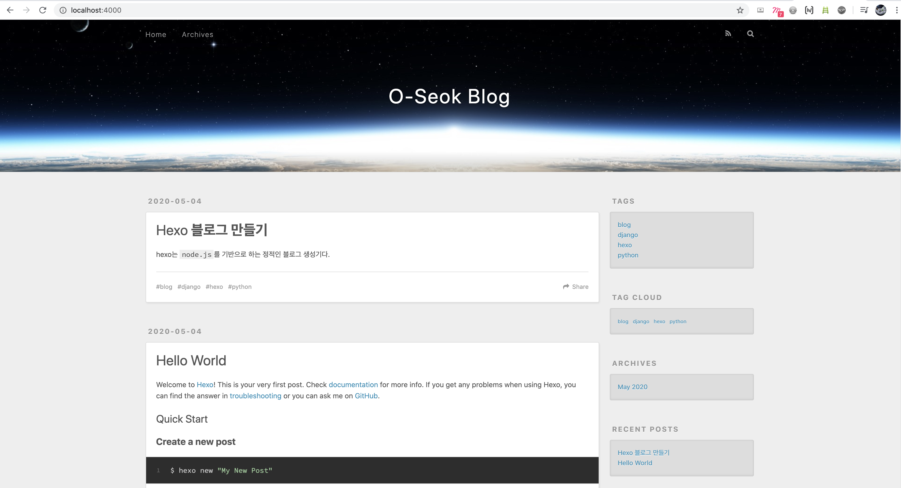
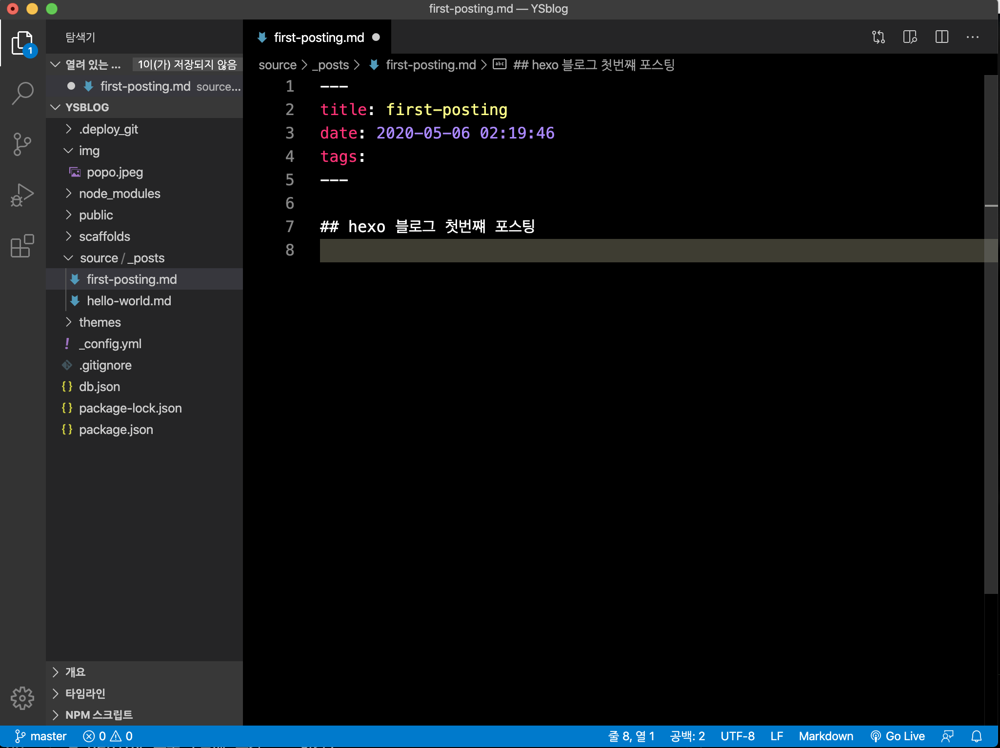
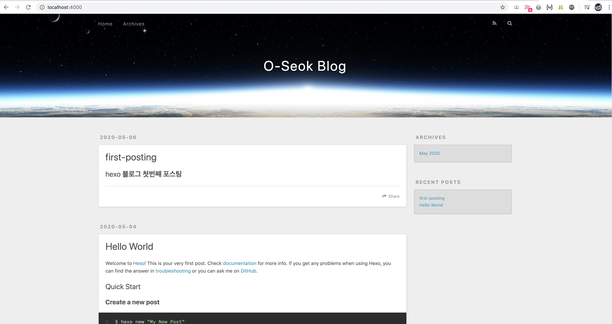
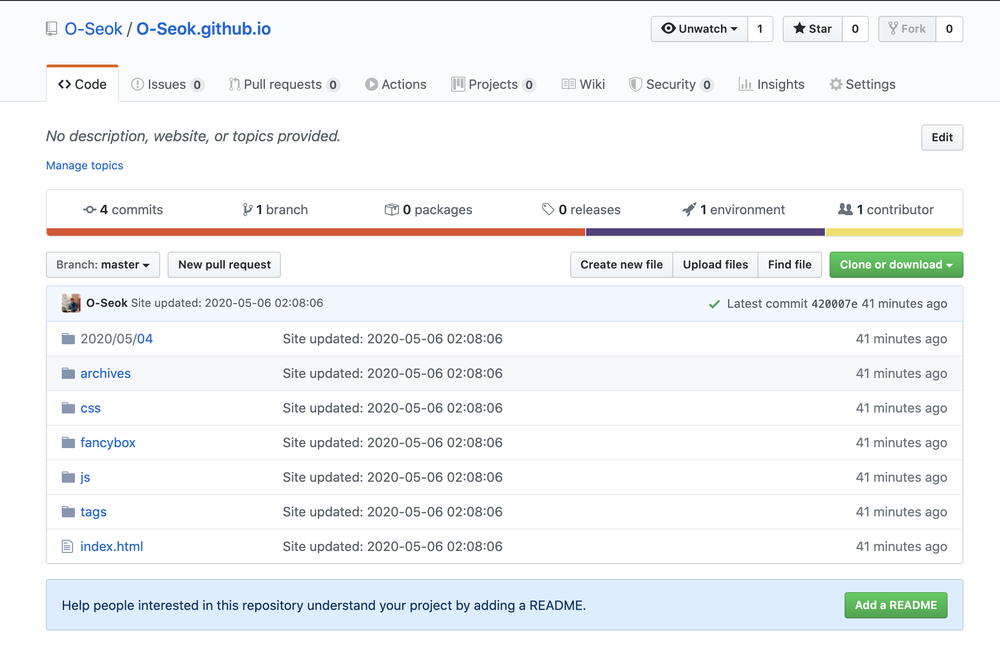
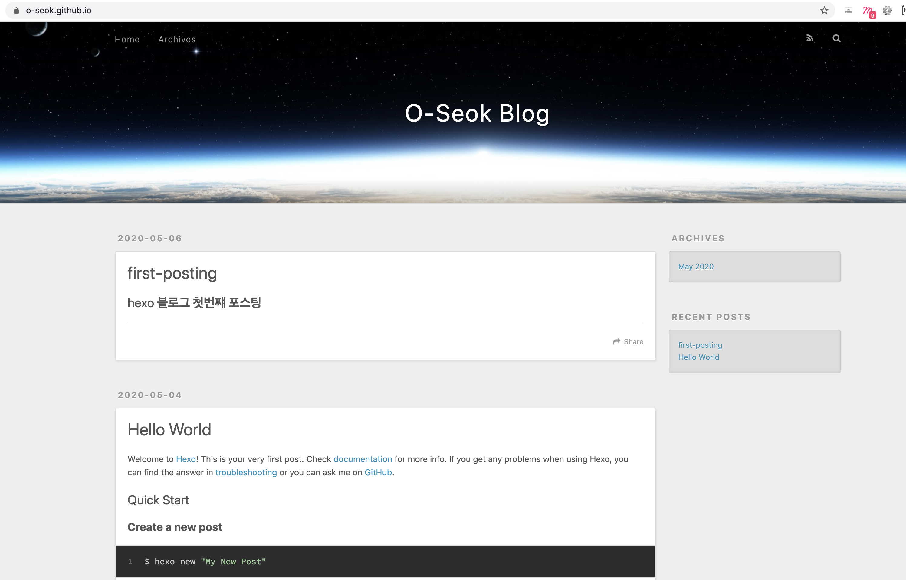

# Hexo로 관리하는 github 블로그 👨🏻‍💻
Hexo로 블로그를 관리해보자.  
[Hexo Document](https://hexo.io/ko/docs/)를 참고하여 정리 했고, 자세한 사항은 사이트에서 확인 할 수 있다.

## # 준비단계

### github repository 만들기
github에서 `(user name).github.io` repository를 만든다. ( 나의 경우는 O-Seok.github.io )  
`clone`하여 내 로컬에도 환경을 만들어 놓는다.  

### node 설치하기
Hexo는 node.js 기반의 정적 사이트 생성기의 일종이므로 node를 설치해준다. 
```
$ brew install node
```

## # hexo 설치
hexo를 설치 해준다.  
`npm install -g hexo-cli` 해도 되지만
권한이 필요한 경우 `sudo`를 붙여서 설치해준다.
```
$ sudo npm install -g hexo-cli
```
hexo 블로그로 이용할 폴더의 hexo를 초기화 시켜준다.  
내 폴더 이름은 YSblog라 했다.
```
$ hexo init <folder>
$ cd <folder>
$ npm install
```
로컬영역에서 hexo server를 구동시킨다.  
http://localhost:4000 로 접속해서 확인한다.
```
$ hexo server
```
```
claudjung@jeong-yeongseog-ui-MacBookPro YSblog % hexo server
INFO  Start processing
INFO  Hexo is running at http://localhost:4000 . Press Ctrl+C to stop.
```


## # 첫 포스트 작성
hexo 설치가 잘 되었다면 포스팅을 해본다.  
포스트 생성
```
$ hexo new post "title"
```
```
claudjung@jeong-yeongseog-ui-MacBookPro YSblog % hexo new post first-posting
INFO  Created: ~/Documents/dev/YSblog/source/_posts/first-posting.md
claudjung@jeong-yeongseog-ui-MacBookPro YSblog % 
```
해당 위치에서 vscode를 열어 포스트를 편집한다. 



`hexo clean` : 정리를 한번 해준다.  
`hexo generate` : git의 commit 느낌  
`hexo deploy` : git의 push의 느낌이랄까..

순서대로(hexo clean -> hexo generate -> hexo deploy) 명령을 해주고 hexo server를 구동  
로컬에서 포스팅이 되었는지 확인해준다.  



## # (User name).github.io 와 연동시키기
이제 나의 github에 있는 O-Seok.github.io를 hexo로 관리하기 위해서 연동시켜보자.

### 설정
hexo-deployer-git 을 설치한다.
```
$ npm install hexo-deployer-git --save
```
`_config.yml` 을 편집한다.
```
claudjung@jeong-yeongseog-ui-MacBookPro YSblog % ls -al
total 232
drwxr-xr-x   14 claudjung  staff    448  5  6 02:18 .
drwxr-xr-x    8 claudjung  staff    256  5  4 15:20 ..
drwxr-xr-x    9 claudjung  staff    288  5  6 02:18 .deploy_git
-rw-r--r--    1 claudjung  staff     65  5  4 15:20 .gitignore
-rw-r--r--    1 claudjung  staff   2423  5  6 02:06 _config.yml
-rw-r--r--    1 claudjung  staff  26113  5  6 02:34 db.json
drwxr-xr-x    3 claudjung  staff     96  5  4 15:33 img
drwxr-xr-x  202 claudjung  staff   6464  5  4 15:46 node_modules
-rw-r--r--    1 claudjung  staff  74015  5  4 15:46 package-lock.json
-rw-r--r--    1 claudjung  staff    617  5  4 15:46 package.json
drwxr-xr-x    8 claudjung  staff    256  5  6 02:18 public
drwxr-xr-x    5 claudjung  staff    160  5  4 15:20 scaffolds
drwxr-xr-x    3 claudjung  staff     96  5  4 15:20 source
drwxr-xr-x    4 claudjung  staff    128  5  4 16:58 themes
claudjung@jeong-yeongseog-ui-MacBookPro YSblog % vim _config.yml
```
먼저 URL의 `url: ` 부분을 나의 github.io repository 이름으로 수정해준다.
```
# URL
## If your site is put in a subdirectory, set url as 'http://yoursite.com/child' and root as '/child/'
url: https://O-Seok.github.io
root: /
permalink: :year/:month/:day/:title/
permalink_defaults:
pretty_urls:
  trailing_index: true # Set to false to remove trailing 'index.html' from permalinks
  trailing_html: true # Set to false to remove trailing '.html' from permalinks
```
vim의 insert 모드로 변환 후, #Deployment 의   
`type:  ` : git  
`repo:  ` : https://github.com/(User name)/(User name).github.io.git  
수정해준다.

> ⚠️ 주의   
> type, repo 는 앞에서 2칸을 띄우고 작성한다.  
> : 이후엔 한칸을 띄우고 작성한다.  
> (이것은 약속! 이렇게 해야 적용이 된다.)  

```
# Deployment
## Docs: https://hexo.io/docs/deployment.html
deploy:
  type: git
  repo: https://github.com/O-Seok/O-Seok.github.io.git
```
다음으로 `hexo clean` , `hexo generate`, `hexo deploy` 를 순서대로 명령해준다.  
hexo로 관리하던 블로그용 폴더 안의 파일들이 github의 github.io repository에 덮어 씌여진다. 

  

브라우저 url에 블로그 주소를 입력하면 hexo가 된 것을 확인 할 수 있다.  
BRAVO ~~ !!! 👏🏼




## # 끝으로 `키워드`
  - sudo npm install -g hexo-cli
  - hexo init
  - hexo new post
  - serer, clean, generate, deploy
  - .config_yml
    - url:
    - deploy: 
      - type: , repo: 설정 법칙 