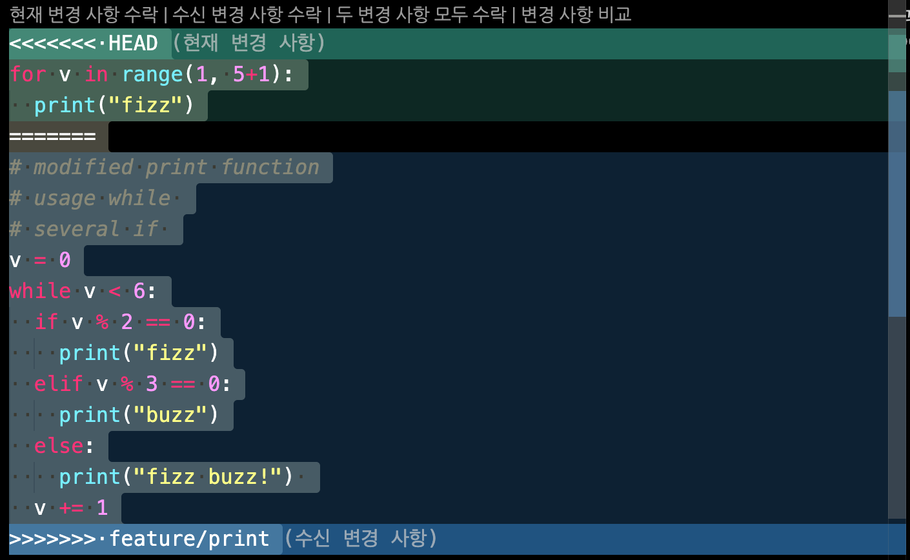

# branch, merge, conflict

## # branch 
git에는 master 뿐만 아닌 여러가지 branch를 새로 만들어서 작업 할 수 있다.  
대표적으로 어떠한 프로젝트를 진행 할 때 다음과 같은 branch를 사용한다.  

**`master`** : 클라이언트, 고객에게 배포될 최종 코드 branch  
**`develop`** : 개발 단계의 최종 코드 branch  
**`feature`** : 기능단위 개발 branch  

### **branch 확인**
현재 branch 존재들을 확인 할 수 있다.
```
$ git branch
```

### **branch 생성**
```
$ git branch (생성할 branch 이름)
```

### **branch 변경**
원하는 branch로 변경하여 작업 할 수 있다.
```
$ git checkout (branch 이름)
```

### **branch 삭제**
```
$ git branch -D (삭제할 branch 이름)
```
---
## # merge
현재 branch에서 다른 branch의 내용들을 병합할 때 사용한다.

현재 branch : develop  
fizz.py: 비어있음
```

~                                                                               
~                                                                               
~                                                                               
~                                                                               
~                                                                               
~                                                                               
~                                                                               
~                                                                               
~                                                                               
~                                                                               
~                                                                       
"fizz.py" 0L, 0C
```

**branch를 feature/print 로 변경** 한다.

```
claudjung@jeong-yeongseog-ui-MacBookPro git_merge % git checkout feature/print
'feature/print' 브랜치로 전환합니다
claudjung@jeong-yeongseog-ui-MacBookPro git_merge % git branch
  develop
* feature/print
  master
claudjung@jeong-yeongseog-ui-MacBookPro git_merge % 
```

fizz.py 파일 내에 print()를 작성한다.

```
print("print at feature/print branch.")
~                                                                               
~                                                                               
~                                                                               
                                                             
-- INSERT --
```
현재 branch: feature/print  
fizz.py: print('print at feature/print branch')
```
claudjung@jeong-yeongseog-ui-MacBookPro git_merge % python fizz.py 
print at feature/print
```
**파이썬 코드가 잘 실행 되는지 확인** 한 후, **add, commit**을 한다.  
다시 **branch를 develop으로 변경** 한다.  
```
claudjung@jeong-yeongseog-ui-MacBookPro git_merge % git checkout develop 
'develop' 브랜치로 전환합니다
```
feature/print branch를 **`merge`** 한다.
```
claudjung@jeong-yeongseog-ui-MacBookPro git_merge % git merge feature/print
업데이트 중 125521b..f64c135
Fast-forward
 fizz.py | 1 +
 1 file changed, 1 insertion(+)

```
잘 병합되었는지 비어있던 fizz.py 파일을 확인 해 본다.
```
print('print at feature/print')
~                                                                                                   
~                                                                                                   
~                             
              
~                                                                                                   
~                                                                                                   
"fizz.py" 1L, 32C

```
잘 실행 되는지도 확인 ✔️
```
claudjung@jeong-yeongseog-ui-MacBookPro git_merge % git branch
* develop
  feature/print
  master
claudjung@jeong-yeongseog-ui-MacBookPro git_merge % python fizz.py 
print at feature/print

```
----

## # conflict
만약 feature branch에서 기존의 develop branch의 코드를 수정하였다고 가정해보자.  
그리고 develop branch에서 수정한 feature branch의 코드를 merge 한다면? **달라진 코드로 인해 충돌이 발생**한다. 이를 **`conflict`** 라고 한다.
  

branch: develop  
fizz.py : 
```py
for v in range(1, 5+1):
  print("fizz")

```
feature/print branch에서 fizz.py 안의 기존 코드를 변경한다.  

branch: feature/print  
fizz.py : 
```py
# modified print function
# usage while 
# several if 
v = 0
while v < 6:
  if v % 2 == 0:
    print("fizz")
  elif v % 3 == 0:
    print("buzz")
  else:
    print("fizz buzz!") 
  v += 1

```
feature/print branch에서 add, commit을 한다.  
develop으로 branch를 변경 후 merge를 하면!!  

**기존 코드가 달라졌기 때문에 conflict가 발생**한다.  

```
claudjung@jeong-yeongseog-ui-MacBookPro git_merge % git merge feature/print
자동 병합: fizz.py
충돌 (내용): fizz.py에 병합 충돌
자동 병합이 실패했습니다. 충돌을 바로잡고 결과물을 커밋하십시오.
claudjung@jeong-yeongseog-ui-MacBookPro git_merge % 
```
아래와 같이 conflict 부분을 표시해준다.  
수정할 부분을 수정 한 후 사용해 주어 conflict를 해결해준다.



