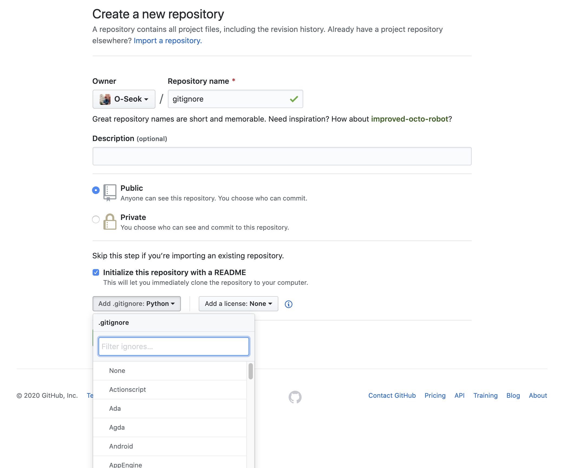
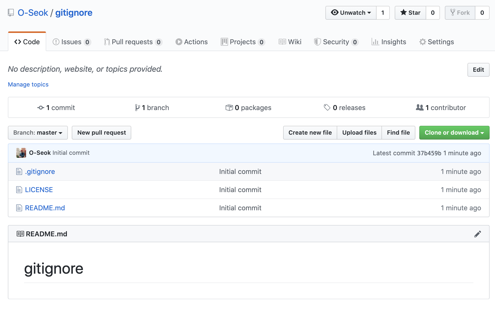
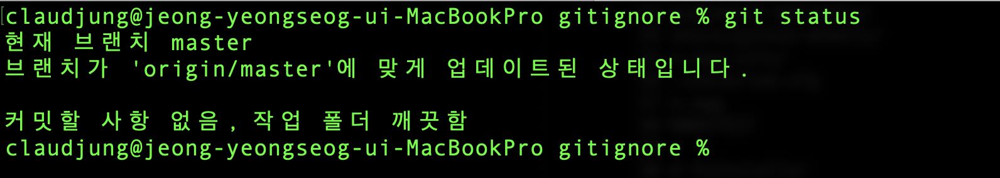
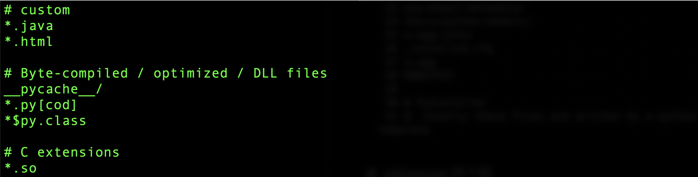
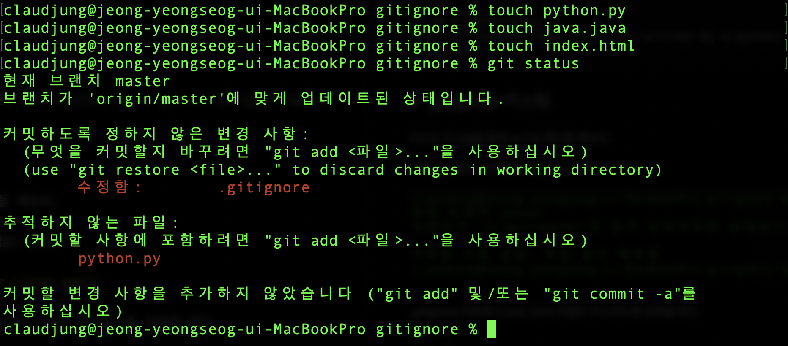
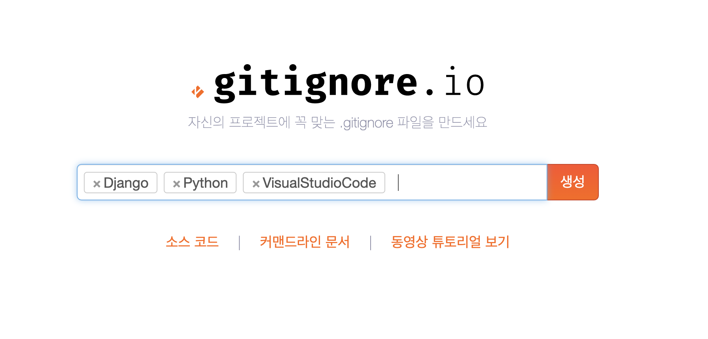
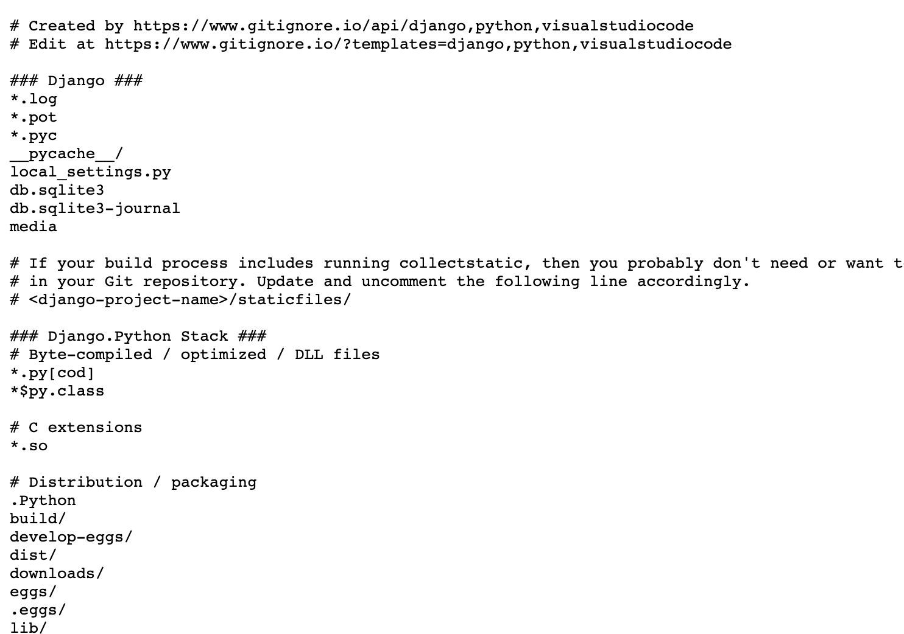

# gitignore

git으로 관리되는 workspace 로컬에서 특정 파일들은 `git이 추적을 하지 않도록 해주는 것`이 바로 `gitignore` 다.

## # .gitignore 생성

### remote repository 에서 생성하는 방법
github 에서 repository 생성 할 때, 아래의 옵션에서 ignore 생성할 수 있다.   
생성하는 repository 에서 사용되는 언어로 설정을 해주면 된다.  



python 으로 설정하고 repository를 생성 하면 .gitignore가 생성된 것을 확인 할 수 있다.



이 원격저장소(remote repository)를 clone 받아서

```
claudjung@jeong-yeongseog-ui-MacBookPro dev % git clone https://github.com/O-Seok/gitignore.git
'gitignore'에 복제합니다...
remote: Enumerating objects: 5, done.
remote: Counting objects: 100% (5/5), done.
remote: Compressing objects: 100% (4/4), done.
remote: Total 5 (delta 0), reused 0 (delta 0), pack-reused 0
오브젝트를 받는 중: 100% (5/5), 완료.
claudjung@jeong-yeongseog-ui-MacBookPro dev % 
```
.gitignore 파일이 생성된 것을 확인 할 수 있고
```
claudjung@jeong-yeongseog-ui-MacBookPro gitignore % ls -al
total 24
drwxr-xr-x   6 claudjung  staff   192  5  6 00:58 .
drwxr-xr-x   5 claudjung  staff   160  5  6 00:58 ..
drwxr-xr-x  12 claudjung  staff   384  5  6 00:59 .git
-rw-r--r--   1 claudjung  staff  1799  5  6 00:58 .gitignore
-rw-r--r--   1 claudjung  staff  1063  5  6 00:58 LICENSE
-rw-r--r--   1 claudjung  staff    11  5  6 00:58 README.md
claudjung@jeong-yeongseog-ui-MacBookPro gitignore % 
```
.gitignore 파일을 확인해보면 python으로 개발할 때 git이 무시해도 되는 설정이 되어 있다.

```
  1 # Byte-compiled / optimized / DLL files
  2 __pycache__/
  3 *.py[cod]
  4 *$py.class
  5 
  6 # C extensions
  7 *.so
  8 
  9 # Distribution / packaging
 10 .Python
 11 build/
 12 develop-eggs/
 13 dist/
 14 downloads/
 15 eggs/
 16 .eggs/
 17 lib/
 18 lib64/
 19 parts/
 20 sdist/
 21 var/
 22 wheels/
 23 pip-wheel-metadata/
 24 share/python-wheels/
 25 *.egg-info/
 26 .installed.cfg
 27 *.egg
 28 MANIFEST
 29 
 30 # PyInstaller
 31 #  Usually these files are written by a python script from a template
```

## # .gitignore 커스텀
약간의 커스텀을 통해 눈으로 확인을 해보자.

현재 git 상태는 추척할 대상이 없는 상태.



.gitignore 파일에서 java, html 파일은 무시하도록 설정을 한다.  
`*.java`  
`*.html`



python.py와 java.java, index.html 파일을 생성한다.  
설정해준 *.java, *.html로 인해 java.java, index.html은 무시  
python.py만 추척하는 것을 확인 할 수 있다.



수동으로 원하는 .gitignore 설정을 할 수 있다.  
[gitignore.io](http://gitignore.io/) 에서 원하는 설정들을 해주면 각각에 맞는 gitignore를 가져올 수 있다.


원하는 것들을 검색해서 넣어준다.



생성 버튼을 눌러주면 다음과 같이 gitignore 설정들이 나온다.



위에 나온 것들을 복사하여 해당하는 .gitignore 파일에 붙여넣기 하여 간편하게 설정을 해줄 수 있다.