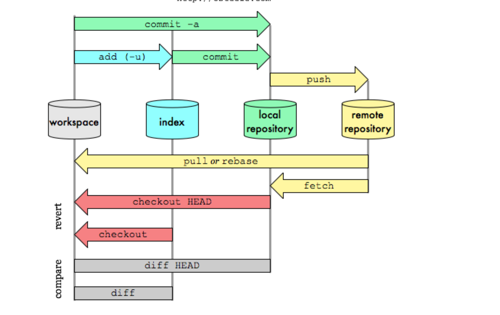
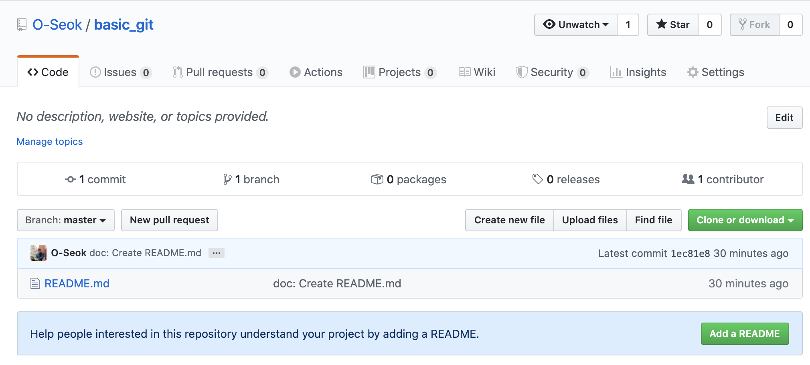

# git & github 

> ## git과 github은 다르다 !
>git
>- 형상관리 즉, 개발한 `프로젝트의 버전 관리`에 용이한 프로그램   
>- 빠른속도, 단순구조, 분산형 저장소 지원, 비선형적 개발(여러개의 브런치) 가능
>- 인터넷이 연결되지 않아도 개발 가능
>- 기능추가는 branch로 개발하여 편안한 개발이 가능
>  
>github
>- git으로 관리되는 `프로젝트들의 저장소`

## # git 데이터관리 흐름
다음 그림은 [최우영 님](https://github.com/ulgoon/essential-git) git&github 수업자료를 참고 



`workspace`: 내 작업 공간  
`index(stage)`: local repository에 저장할 것들을 올리는 곳  
`local repository` : 로컬 저장소  
`remote repository`: 원격 저장소, 프로젝트를 올려서 다른 사람들과 공유 할 수 있고, 다른 사람의 원격 저장소에서 프로젝트를 받을 수도 있다. github에서 생성 가능
  
## # git 설정
`git confing -g` 명령어를 통해 내 로컬 전역에 설정을 해준다.   
이 설정은 수정 사항이 없는 한 처음 한번만 해주면 된다.  
```py
# git 유저 이름
claudjung@ ~ % git config -g user.name O-Seok
# git 유저 이메일
claudjung@ ~ % git config -g user.email totkfa789@gmail.com
# git 에디터는 vim 사용
claudjung@ ~ % git config -g core.editor vim
# git 문서확인은 cat 사용
claudjung@~ % git config -g core.paper cat
```
설정된 사항 체크 ✔️
```py
# git 설정사항 확인
claudjung@ ~ % git config --list
credential.helper=osxkeychain
user.name=O-Seok
user.email=totkfa789@gmail.com
core.editor=vim
core.paper=cat

```

## # git 사용 1 (workspace -> index(range) -> local repo. -> remote repo.)

### **git init, git status**

`git status`로 현재 git의 관리 대상들의 상태를 확인 할 수 있다.  
`git init`으로 workspace가 git 관리대상이 된다.
```py
claudjung@basic_git % git status

# 아직 git 관리 대상 X
fatal: (현재 폴더 또는 상위 폴더 중 일부가) 깃 저장소가 아닙니다: .git

claudjung@basic_git % git init
/Users/claudjung/Documents/git_github_class/basic_git/.git/ 안의 빈 깃 저장소를 다시 초기화했습니다
claudjung@basic_git % git status

# git 관리 대상 O
현재 브랜치 master

아직 커밋이 없습니다

커밋할 사항 없음 (파일을 만들거나 복사하고 "git add"를 사용하면 추적합니다)
```

### **git add**

다음으로 간단히 README.md 파일을 만들어 변동사항을 만들고 `git status` ~


`git add README.md` 명령어로 변동된 사항을 index(stage) 에 올린다.


### **git commit**

내 로컬저장소(local repository)에 마지막으로 올린다. 이것이 `커밋(commit)` !  

`git commit` 후,  
VIM 에디터에 코멘트를 넣고 저장하고 나오면 자동으로 commit이 된다.


완료 했다면,  
`workspace -> index(stage) -> local repository 경로로 저장이 된 상태`이다

> ### Commit
>   - commit은 동작하는 최소단위로 나누어서 진행한다.
>   - 파일간의 연관성이 있어야 한다.


### **git push**

로컬저장소(local repository) -> 원격저장소(remote repository)로 보내주려면  
먼저 [github](https://www.github.com) 에 가입이 되어 있어야 한다.

가입 후 Repository 에서 NEW 버튼 클릭 후, 다음과 같이 프로젝트 이름과 똑같은 이름의 원격저장소를 만들어 준다.


화면에 나오는 주소가 원격저장소(remote repository) 주소이다. 이것을 복사한다.


현재 로컬저장소에는 1개의 commit이 되어 있고, 원격저장소 생성된 상태  
로컬저장소와 원격저장소를 연결해주는 작업을 해준다.
```py
# 복사한 주소로 로컬저장소와 원격저장소를 연결해준다.
git remote add origin https://github.com/O-Seok/basic_git.git
```

`git remote -v` 로 연결된 상태 체크 ✔️
```
claudjung@jeong-yeongseog-ui-MacBookPro basic_git % git remote -v
origin	https://github.com/O-Seok/basic_git.git (fetch)
origin	https://github.com/O-Seok/basic_git.git (push)
```

로컬저장소의 commit 내용을 원격저장소로 보내보자.  
`git push -u origin master`
> 명령어의 -u 는 로컬저장소의 master와 원격저장소의 master를 서로 매칭 시켜주는 것이며, 이는 처음으로 push 할 때만 붙인다.
```
claudjung@jeong-yeongseog-ui-MacBookPro basic_git % git push -u origin master
오브젝트 나열하는 중: 3, 완료.
오브젝트 개수 세는 중: 100% (3/3), 완료.
오브젝트 쓰는 중: 100% (3/3), 225 bytes | 225.00 KiB/s, 완료.
Total 3 (delta 0), reused 0 (delta 0), pack-reused 0
To https://github.com/O-Seok/basic_git.git
 * [new branch]      master -> master
'master' 브랜치가 리모트의 'master' 브랜치를 ('origin'에서) 따라가도록 설정되었습니다.
claudjung@jeong-yeongseog-ui-MacBookPro basic_git % 
```
로컬저장소에서 원격저장소로 보냈고, `git status`로 로컬의 상태를 확인해보면 꺠끗한 상태를 확인할 수 있다.

```
claudjung@jeong-yeongseog-ui-MacBookPro basic_git % git status
현재 브랜치 master
브랜치가 'origin/master'에 맞게 업데이트된 상태입니다.

커밋할 사항 없음, 작업 폴더 깨끗함
```

github의 원격저장소로 가보면 잘 push 된 것을 체크 ( 로컬에서 만든 README.md 확인 ) ✔️



## # git 사용 2 ( remote repo. -> local repo. )
기본적으로 로컬저장소에서부터 원격저장소까지 가는 방법 외에 이번에는  
원격저장소 -> 로컬저장소로 프로젝트를 가져와서 하는 방법을 해보자.

github repository에서 원격저장소를 만든다. 이때, 밑에 단추버튼을 클릭 해서 README 파일이 만들어지는 옵션을 넣어준다. MIT 라이센스로 오픈소스 임을 선택


원격저장소가 만들어 지면 오른쪽 위에 clone or download를 눌러서 주소를 복사한다.


로컬저장소가 만들어질 상위 폴더에서 `clone` 해준다.   

`git clone {원격저장소 주소}`   
하위 폴더에 원격저장소가 만들어 지고 `git status`를 통해 확인해볼 수 있다.
```
claudjung@jeong-yeongseog-ui-MacBookPro git_github_class % git clone https://github.com/O-Seok/basic_git.git
'basic_git'에 복제합니다...
remote: Enumerating objects: 4, done.
remote: Counting objects: 100% (4/4), done.
remote: Compressing objects: 100% (3/3), done.
remote: Total 4 (delta 0), reused 0 (delta 0), pack-reused 0
오브젝트를 받는 중: 100% (4/4), 완료.
claudjung@jeong-yeongseog-ui-MacBookPro git_github_class % ls
basic_git	dev
claudjung@jeong-yeongseog-ui-MacBookPro git_github_class % cd basic_git 
claudjung@jeong-yeongseog-ui-MacBookPro basic_git % git status
현재 브랜치 master
브랜치가 'origin/master'에 맞게 업데이트된 상태입니다.

커밋할 사항 없음, 작업 폴더 깨끗
claudjung@jeong-yeongseog-ui-MacBookPro basic_git % 
```

### # 키워드
  - 로컬저장소 (local repository)
  - index(stage)
  - 원격저장소 remote repository
  - config, init, remote, add, commit, push
  - clone
  - workspace -> stage -> local Repo. -> remote Repo. 방법
  - remote Repo. -> workspace 방법

