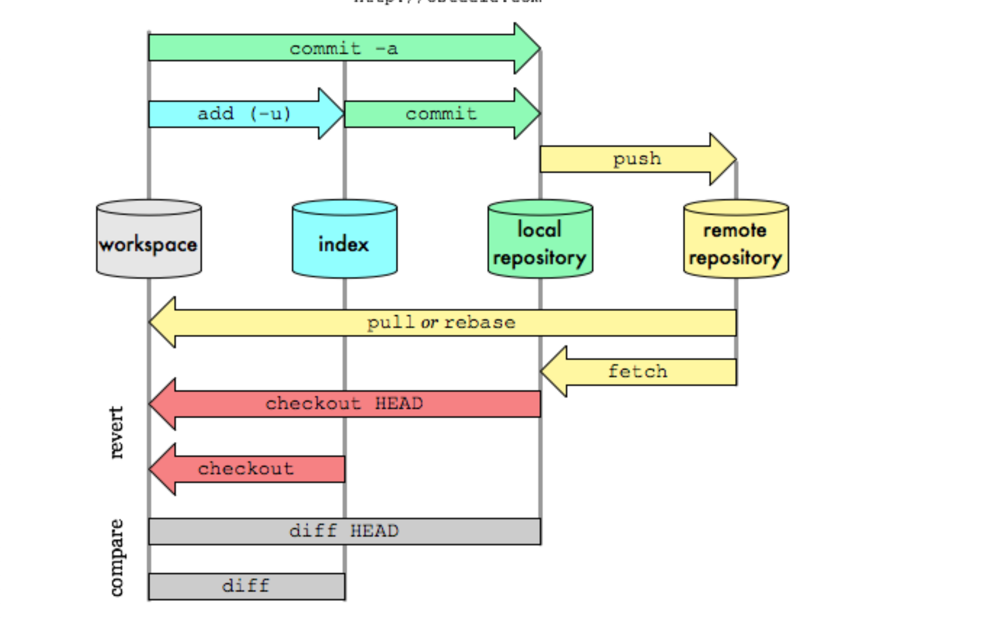

# pull

1. 예를 들어 로그인을 구현하는 프로젝트가 있다.  
2. 프로젝트를 `clone` 하여 내 로컬저장소에 환경을 만든다.
3. 나는 그 프로젝트를 가지고 있는데, 시간이 지나고 나니 프로젝트가 로그아웃까지 업데이트 되었다.
4. 이 시점에서 나의 로컬저장소와 프로젝트의 원격저장소는 다른 상태를 가진다.
5. 이 때, 내 workspace에 최신으로 업데이트 된 프로젝트를 가져오려면??!?!?

## # pull

[최우영 강사님](https://github.com/ulgoon/essential-git) git & github 수업자료 참고



이때는 `pull`을 통해서 clone한 프로젝트의 업데이트 내용을 가져온다.

로컬저장소 별칭(이름)을 확인한다.
```
git remote
```
로컬저장소와 연결된 url이 프로젝트 원격저장소 주소가 맞는지 확인한다.
```
git remote get-url "로컬저장소 이름"
```
workspace의 현재 branch를 확인한다.
```
git branch
```
branch가 master가 아니면 master로 바꿔준다.

> 보통 프로젝트 최종본은 master branch로 올리기 때문에 내 workspace의 branch도 master로 바꿔서 pull 받는다.
```
git checkout master
```
나의 workspace master branch에 `pull` 한다.
```py
# git pull "저장소 별칭(이름)" "branch"
git pull origin master 
```