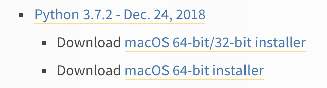
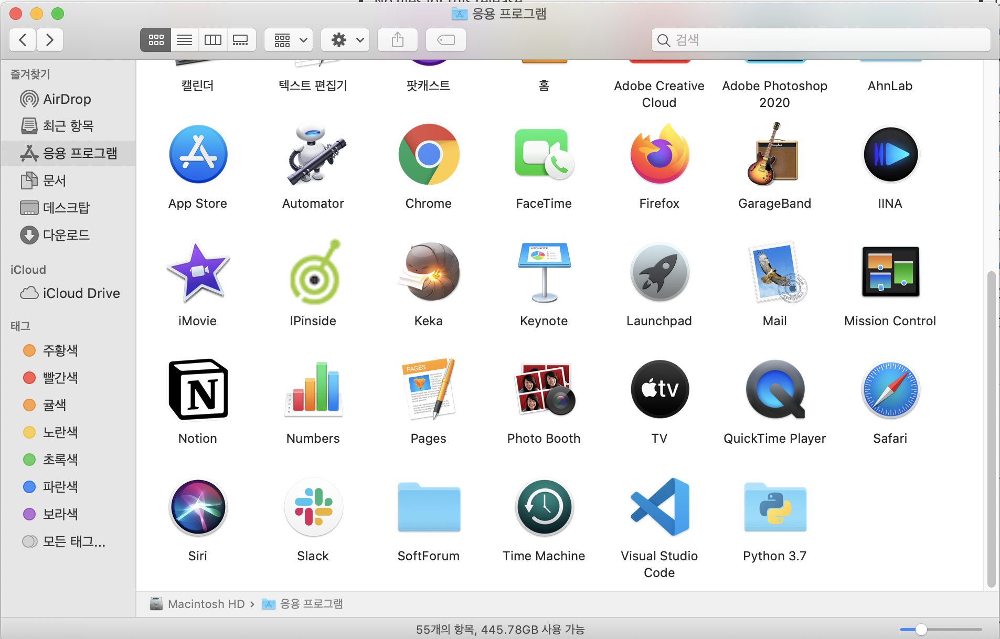

# 시작부터 차곡차곡 자 그럼 설치부터...🧩
Python을 공부하기 위해서 필요한 프로그램들을 먼저 다운로드 받아본다.

## # 프로그램 설치

### Python 설치

앞으로 공부할 언어 `Python`을 설치 해본다.  
[Python 홈페이지](https://www.python.org/downloads/)로 접속해서 나에게 맞는 MAC버전으로 다운로드 받아서 설치해준다.  
python도 여러 버전이 release 되어 있는데 그 중에서 verseion 3.7.2 를 다운 받았다.
  

### VSCode 설치

개발할 때 다양한 에디터들이 있다. 어떤 분들은 그날의 기분에 따라 에디터를 정해서 개발할 정도로 종류가 많다고 한다. 나는 그 중에서 `VSCode (Visual Studio Code)`로 PICK !

[vscode홈페이지](https://code.visualstudio.com/download)에서 각 운영체제에 맞는 것을 다운로드 해서 설치해준다.

이렇게 맨 아래 보이는 것처럼 사용할 프로그램은 다운로드 완료!!  

  
---