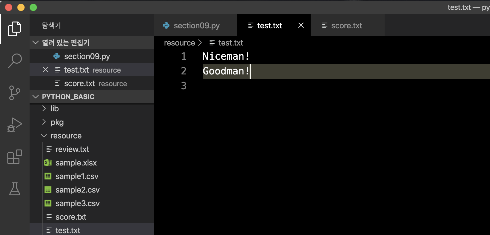

# 파일 읽고 쓰기
파일 가져오기 기본은  `open()` 함수를 사용한다.  
open()을 이용해 파일을 가져왔으면 `마지막에는 꼭 close()`를 해준다.
```py
open('파일PATH', '모드')
```
> ✔️ 모드   
> **r** : 읽기  
> **w** : 쓰기  
> **a** : 더하기


## # 읽기
같은 디렉토리에 있는 resource 폴더 안의 review.txt 파일을 읽어본다.  

resource/review.txt
```
The film, projected in the form of animation,
imparts the lesson of how wars can be eluded through reasoning and peaceful dialogues,
which eventually paves the path for gaining a fresh perspective on an age-old problem.
The story also happens to centre around two parallel characters, Shundi King and Hundi King,
who are twins, but they constantly fight over unresolved issues planted in their minds
by external forces from within their very own units.
```

읽기 모드는 **`'r'`** 
```py
# open() 불러온다.
f = open('./resource/review.txt', 'r')
content = f.read()
print(content)
f.close()
```

## # with
open()은 꼭 close()를 해주어야 한다.  
`with`, `as`를 사용해서 open()하면 **close()를 안해줘도 된다.**

```py
with open('./resource/review.txt', 'r') as f:
content = f.read()
print(content)
```

### **읽어와 데이터 처리(숫자값 불러와 평균 구하기)**
resource/score.txt
```
95
78
92
89
100
66
```
score.txt 파일을 읽어와 평균을 구하는 데이터 처리를 해본다.
```py
score = []
with open('./resource/score.txt','r') as f:
  for line in f:
    score.append(int(line))
  
print('Average: {:6.3}'.format(sum(score)/len(score)))
```
```
Average :   86.7
```

## # 쓰기
쓰기 모드로 하면 결과값은 해당 디렉토리에 파일이 만들어 진다.  
단, 같은 이름의 파일을 쓰기 하면 위에 덮어진다.  
쓰기 모드는 **`'w'`**  

```py
with open('./resource/test.txt','w') as f:
  f.write('Niceman!\n')
```

## # 더하기(추가하기)
더하기 모드의 결과값은 해당 디렉토리 파일에 내용이 추가된다.  
더하기 모드 **`'a'`**

```py
with open('./resource/test.txt','a') as f:
  f.write('Niceman!\n')
```

### **쓰기, 더하기로 인해 resource/ 디렉토리 안에 test.txt 파일이 생성되고 안에 내용이 추가되었다.**




