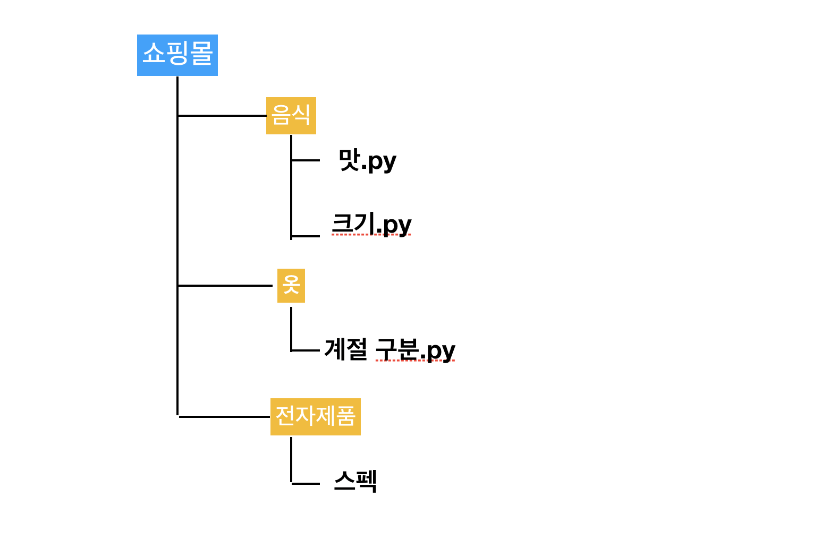
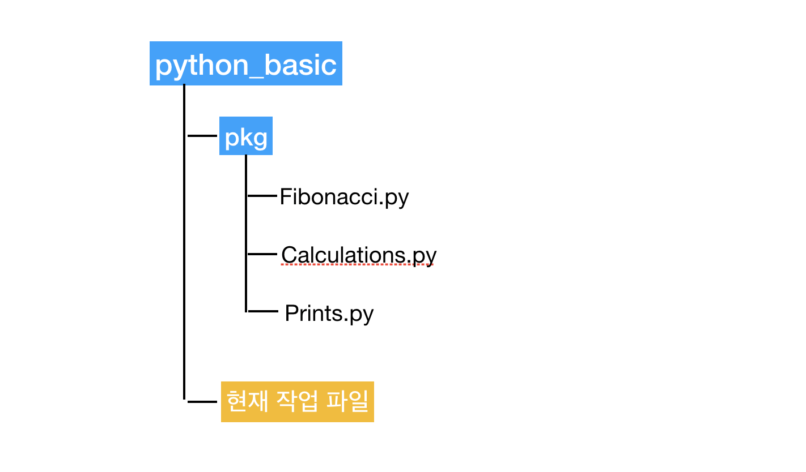

# Package & module
`Package`는 도트(.)를 사용하여 파이썬 모듈들을 디렉토리 구조로 관리할 수 있게 해준다.   
파이썬 패키지는 디렉토리와 파이썬 모듈로 이루어진다.

간단한 예시로 보면 



음식 디렉토리는 맛.py, 크기.py 모듈을 가진 패키지  
옷 디렉토리는 계절구분.py 모듈을 가진 패키지  
전자제품 디렉토리는 스펙 모듈을 가진 패키지


## # package 사용
다음과 같이 패키지와 안에 모듈이 있다. 



fibonacci.py 모듈 
```py
class Fibonacci:
  def __init__(self, title="fibonacci"):
    self.title = title

  def fib(n):
    a, b = 0, 1
    while a < n:
      print(a, end=' ')
      a, b = b, a+b
    print()

  def fib2(n):
    result = []
    a, b = 0, 1
    while a < n:
      result.append(a)
      a, b = b, a+b
    return result
```

calculations.py 모듈
```py
def add(l, r):
  return 1 + r

def mul(l, r):
  return 1 * r

def div(l, r):
  return 1 / r
```

prints.py 모듈
```py
def prt1():
  print("I'm Niceboy!")

def prt2():
  print("I'm GoodBoy!")
```

현재 작업하는 위치에서 pkg 패키지 안에 모듈을 사용하고 싶으면 다음과 같은 방법 들로 사용할 수 있다.

fibonacci.py 안의 Fibonacci 클래스 사용

```py
from pkg.fibonacci import Fibonacci

Fibonacci.fib(300)

print("ex1 : ", Fibonacci.fib2(400))
print("ex1 : ", Fibonacci().title)
```

fibonacci.py 안의 모든 것들을 사용하고 싶을 때 (추천 X)
```py
from pkg.fibonacci import *

Fibonacci.fib(500)

print("ex2 : ", Fibonacci.fib2(500))
print("ex2 : ", Fibonacci().title)
```

### **Alias**
모듈들을 가져다 쓸 때, 정의된 이름을 그대로 사용하기 보단 간략하게 줄여 사용할 때 사용한다.

```py
from pkg.fibonacci import Fibonacci as fb

fb.fib(1000)

print("ex3 : ", fb.fib2(500))
print("ex3 : ", fb().title)
```

calculations.py 안의 함수들을 사용하면

```py
import pkg.calculations as c

print("ex4: ", c.add(10, 100))
print("ex4: ", c.mul(10, 100))
```

calculations.py 안의 함수들 중에 특정한 함수만 사용하려면

```py
from pkg.calculations import div as d

print("ex5: ", int(d(100, 10)))
```

