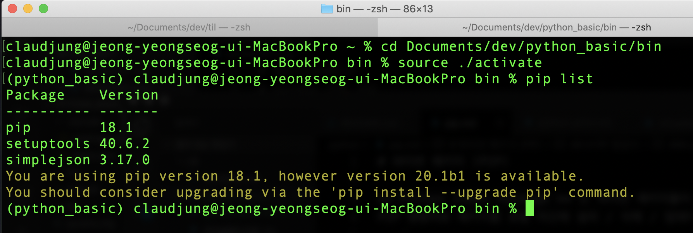
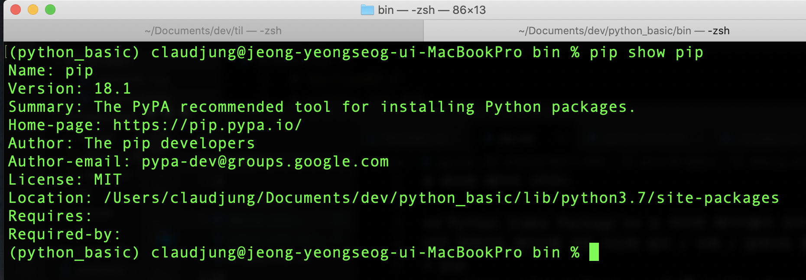
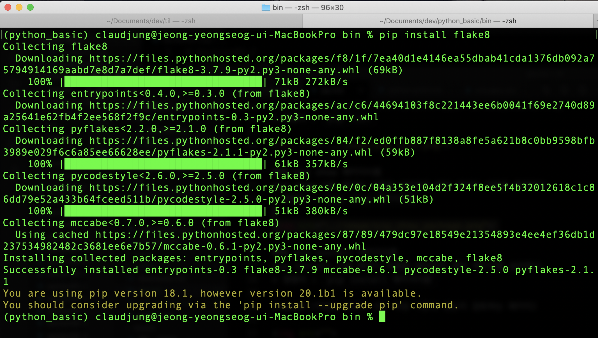
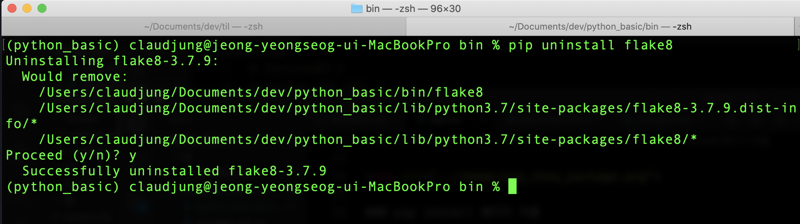

# 파이썬 패키지 (PIP)

**`Python Index Package`** 는 파이썬 패키지들이 모여 있는 저장소이다.  
PIP 명령어로 패키지를 로컬 머신에 설치 / 삭제 / 업데이트 할 수 있다.
> pip
> - 파이썬으로 작성 된 패키지 소프트웨어를 관리하는 패키지 관리 시스템 
> - 파이썬 2.7.9 이후 버전과 파이썬 3.4 이후 버전은 pip를 기본적으로 포함
  
## # PIP 명령어
pip를 이용하기 위해 python 환경에 있어야 한다.  
python 가상환경을 실행하여 pip를 사용해보겠다. < 참조 : [가상환경 설정](../etc/virtualen.md) >

### pip list
pip list 명령으로 현재 설치된 패키지 목록을 볼 수 있다.
업데이트가 필요한 패키지가 있는지도 알려준다.  
> 명령어 : `pip list`



### pip show 패키지 이름
pip show 다음 패키지 이름을 넣어주면 해당 패키지 내용을 출력한다.  
> 명령어 : `pip show 패키지이름`



### pip install 패키지 이름
pip install 다음 패키지 이름을 넣어주면 해당 패키지를 설치한다.  
> 명령어 : `pip install 패키지이름`  

flake8 (작성한 코드가 코드 작성 기준에 맞는지 검토하는 패키지)  



### pip install --upgrade 패키지 이름
패키지를 업그레이드 할수 있다.  
> 명령어 : `pip install --upgrade 패키지이름`

### pip uninstall 패키지 이름
패키지를 삭제할 수도 있다.
> 명령어 : `pip uninstall 패키지이름`

flake8 패키지를 삭제해본다.  
명령어 입력 후, 패키지를 정말 삭제 할 것인지 한번 더 물어본다.



### pip help

```
(python_basic) claudjung@jeong-yeongseog-ui-MacBookPro bin % pip help 

Usage:   
  pip <command> [options]

Commands:
  install                     Install packages.
  download                    Download packages.
  uninstall                   Uninstall packages.
  freeze                      Output installed packages in requirements format.
  list                        List installed packages.
  show                        Show information about installed packages.
  check                       Verify installed packages have compatible dependencies.
  config                      Manage local and global configuration.
  search                      Search PyPI for packages.
  wheel                       Build wheels from your requirements.
  hash                        Compute hashes of package archives.
  completion                  A helper command used for command completion.
  help                        Show help for commands.

General Options:
  -h, --help                  Show help.
  --isolated                  Run pip in an isolated mode, ignoring environment variables and
                              user configuration.
  -v, --verbose               Give more output. Option is additive, and can be used up to 3
                              times.
  -V, --version               Show version and exit.
  -q, --quiet                 Give less output. Option is additive, and can be used up to 3
                              times (corresponding to WARNING, ERROR, and CRITICAL logging
                              levels).
  --log <path>                Path to a verbose appending log.
  --proxy <proxy>             Specify a proxy in the form [user:passwd@]proxy.server:port.
  --retries <retries>         Maximum number of retries each connection should attempt
                              (default 5 times).
  --timeout <sec>             Set the socket timeout (default 15 seconds).
  --exists-action <action>    Default action when a path already exists: (s)witch, (i)gnore,
                              (w)ipe, (b)ackup, (a)bort).
  --trusted-host <hostname>   Mark this host as trusted, even though it does not have valid or
                              any HTTPS.
  --cert <path>               Path to alternate CA bundle.
  --client-cert <path>        Path to SSL client certificate, a single file containing the
                              private key and the certificate in PEM format.
  --cache-dir <dir>           Store the cache data in <dir>.
  --no-cache-dir              Disable the cache.
  --disable-pip-version-check
                              Don't periodically check PyPI to determine whether a new version
                              of pip is available for download. Implied with --no-index.
  --no-color                  Suppress colored output

```