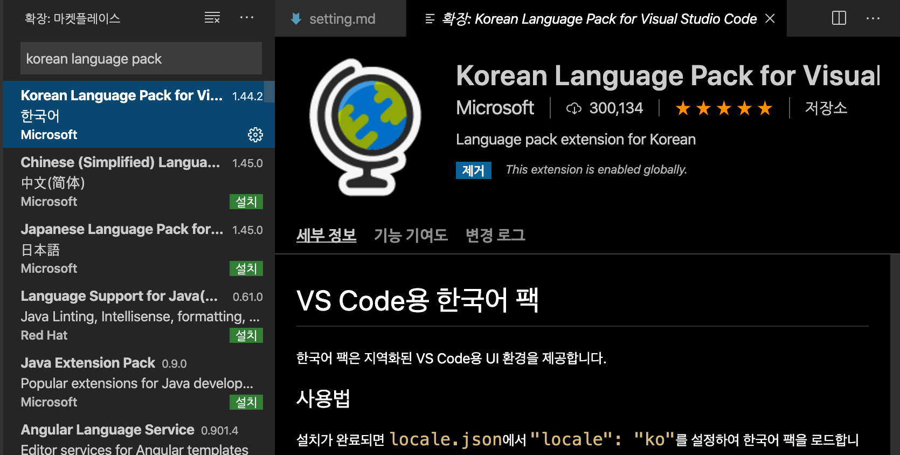

# VScode 초기 설정

설치된 VScode에서 python3를 다루기 위해 간단한 설정들을 해본다.

## # 확장설치

VScode 내에서 사용할 때 편안하게 해주기 위해서 마켓이라는 곳에서 프로그램들을 설치 해줄 수 있다.

>위에 `보기`를 눌러 `확장`을 눌러준다.  
>단축기 : `Command + Shift + X`

  

### python 설치
마켓 검색창에 python을 검색해주고 설치해준다.  

### Korean Language Pack 설치
VScode 한글용으로 사용하기 위해 검색창에 Korean Language Pack을 찾아 설치해준다.  

  
---
  
## # 명령팔레트를 통해서 작업파일에 task, setting 설정하기
명령팔레트를 통해서 현재 작업하고 있는 폴더 내에 옵션 등 세세한 설정을 세팅할 수 있다.
  
> 명령팔레트   
> `보기`에서 `명령팔레트` 선택  
> 단축기: `Command + Shift + P`

### Select Interpreter 설정
여러버전의 python 컴파일러가 설치 되어 있을 때 실행하는 python interpreter의 버전을 선택해준다.

명령팔레트를 연 후, `python select interpreter` > `python 3.7.2(설치된 혹은 사용할 버전)` 클릭 해주면 된다.
  
다음과 같이 setting.json 파일이 생성되고, 안에 다음과 같은 interpreter설정이 된다.  

### Task runner 설정
task runner 설정으로 간단하게 디버깅을 해줄 수 있게 설정해준다.  

명령팔레트를 연 후, `configure task` > `create task.json file from template` > `Others` 클릭해주면 된다.
  
다음과 같이 task.json 파일이 생성되고, 안에는 다음과 같이 설정을 해준다.

