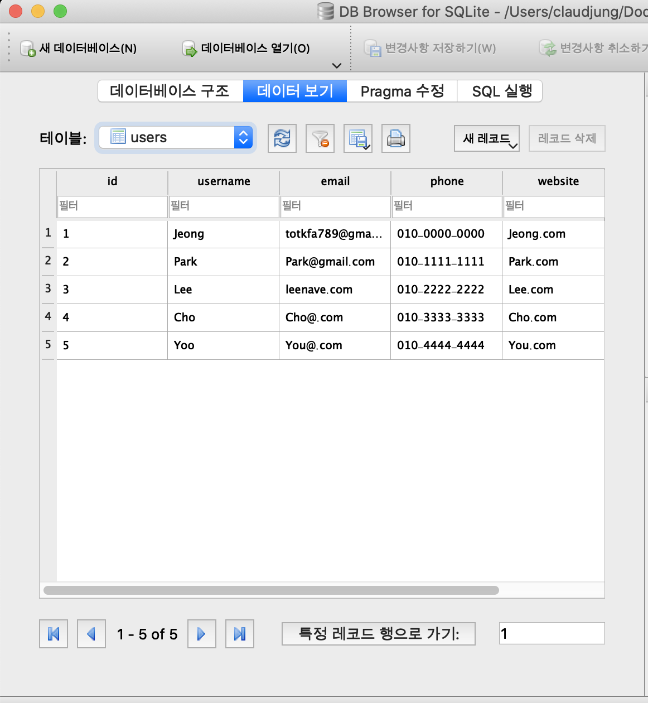

# DB 조회 
등록되어 있는 데이터를 조회 해본다.
  
users 데이터:



## # DB파일 조회(없으면 새로 생성)

```py
import sqlite3

conn = sqlite3.connect('/Users/claudjung/Documents/dev/python_basic/resource/database.db')
```
**`connect()`** 로 DB파일 위치와 파일 이름을 조회해보고, 없으면 생성해준다.

## # 커서 바인딩
```py
c = conn.cursor()
```

**`cursor()`**  
기본적으로 데이터의 마지막 부분을 가리키고 있다.  
현재 커서 위치의 상태를 기억한다.

## # 데이터 조회

### **데이터 조회(전체)**

```py
c.execute("SELECT * FROM users")
```
**`execute()`** 안에 users 데이터의 전체를 조회하는 sql문을 넣어서 조회해온다.

```py
print('all -> \n', c.fetchall())
```
```
all -> 
 [(1, 'Jeong', 'totkfa789@gmail.com', '010-0000-0000', 'Jeong.com', '2020-05-21 12:18:07'), (2, 'Park', 'Park@gmail.com', '010-1111-1111', 'Park.com', '2020-05-21 12:18:07'), (3, 'Lee', 'leenave.com', '010-2222-2222', 'Lee.com', '2020-05-21 12:18:07'), (4, 'Cho', 'Cho@.com', '010-3333-3333', 'Cho.com', '2020-05-21 12:18:07'), (5, 'Yoo', 'You@.com', '010-4444-4444', 'You.com', '2020-05-21 12:18:07')]
```

#### **1개 로우 선택**
```py
print('One -> \n', c.fetchone())
```
**`fetchone()`** : 조회해 온 데이터 중 1개를 출력한다.
```
One -> 
 (1, 'Jeong', 'totkfa789@gmail.com', '010-0000-0000', 'Jeong.com', '2020-05-21 12:18:07')
```

#### **지정 로우 선택**
```py
print('Three -> \n', c.fetchmany(size = 3))
```
**`fetchmany(size = ?)`** : size 값을 지정해줘서 조회해 온 데이터 중 지정한 값만큼 출력한다.
```
Three -> 
 [(1, 'Jeong', 'totkfa789@gmail.com', '010-0000-0000', 'Jeong.com', '2020-05-21 12:18:07'), (2, 'Park', 'Park@gmail.com', '010-1111-1111', 'Park.com', '2020-05-21 12:18:07'), (3, 'Lee', 'leenave.com', '010-2222-2222', 'Lee.com', '2020-05-21 12:18:07')]
```

#### **cursor에 대한 이해**
```py
c.execute("SELECT * FROM users")

print('One -> \n', c.fetchone())
print('Three -> \n', c.fetchmany(size = 3))
print('all -> \n', c.fetchall())
```
DB파일에서 전체 데이터를 불러온 후, 1개, 지정갯수, 전체를 차례대로 실행 한 후 결과값을 보면 위에 각각 출력한 값과는 다르게 나올 것이다.

```
One -> 
 (1, 'Jeong', 'totkfa789@gmail.com', '010-0000-0000', 'Jeong.com', '2020-05-21 12:18:07')

Three -> 
 [(2, 'Park', 'Park@gmail.com', '010-1111-1111', 'Park.com', '2020-05-21 12:18:07'), (3, 'Lee', 'leenave.com', '010-2222-2222', 'Lee.com', '2020-05-21 12:18:07'), (4, 'Cho', 'Cho@.com', '010-3333-3333', 'Cho.com', '2020-05-21 12:18:07')]

all -> 
 [(5, 'Yoo', 'You@.com', '010-4444-4444', 'You.com', '2020-05-21 12:18:07')]
```

위와 같이 다음 순서에서부터 지정된 명령어에 따라 데이터를 가져온 것을 확인 할 수 있다.  
이는 **`cursor가 현재 위치를 저장`** 하는 특성 때문이다.

### **데이터조회(조건부 조회)**
데이터의 테이블 안의 특정 속성과 값들을 지정하여 조회 해 올 수 있다.

보통 index, id, 주민번호 등 중복이 없는 primary key값들을 지정해서 가져오는게 처리하기가 좋다.  

id값을 지정하여 조회 해본다.

#### **튜플숫자**
```py
param1 = (3,)
c.execute("SELECT * FROM users WHERE id = ?", param1)
print('param1', c.fetchone())
```
```
param1 (3, 'Lee', 'leenave.com', '010-2222-2222', 'Lee.com', '2020-05-21 12:18:07')
```

#### **숫자**
```py
param2 = 4
c.execute('SELECT * FROM users WHERE id = "%s"' % param2)
print('param2', c.fetchone())
```
```
param2 (4, 'Cho', 'Cho@.com', '010-3333-3333', 'Cho.com', '2020-05-21 12:18:07')
```

#### **딕셔너리**
```py
c.execute('SELECT * FROM users WHERE id = :Id' , {"Id": 5})
print('param3', c.fetchone())
```
```
param3 (5, 'Yoo', 'You@.com', '010-4444-4444', 'You.com', '2020-05-21 12:18:07')
```

#### **튜플**
```py
param4 = (3, 5)
c.execute("SELECT * FROM users WHERE id IN(?,?)", param4)
print('param4', c.fetchall())
```
```
param4 [(3, 'Lee', 'leenave.com', '010-2222-2222', 'Lee.com', '2020-05-21 12:18:07'), (5, 'Yoo', 'You@.com', '010-4444-4444', 'You.com', '2020-05-21 12:18:07')]
```

#### **format 스타일**
```py
c.execute("SELECT * FROM users WHERE id IN('%d','%d')" % (3, 4))
print('param5', c.fetchall())
```
```
param5 [(3, 'Lee', 'leenave.com', '010-2222-2222', 'Lee.com', '2020-05-21 12:18:07'), (4, 'Cho', 'Cho@.com', '010-3333-3333', 'Cho.com', '2020-05-21 12:18:07')]
```

#### **여러가지 딕셔너리**
```py
c.execute("SELECT * FROM users WHERE id=:id1 OR id=:id2", {"id1": 2, "id2": 5})
print('param6', c.fetchall())
```
```
param6 [(2, 'Park', 'Park@gmail.com', '010-1111-1111', 'Park.com', '2020-05-21 12:18:07'), (5, 'Yoo', 'You@.com', '010-4444-4444', 'You.com', '2020-05-21 12:18:07')]
```


## # Dump 출력
현재 데이터를 명령어 까지 포함하여 파일로 만들어 준다.  
dump파일로 쉽게 데이터를 생성 할 수 있다.

```py
with conn:
  with open('/Users/claudjung/Documents/dev/python_basic/resource/dump.sql','w') as f:
    for line in conn.iterdump():
      f.write('%s\n' % line)
```
위와 같이 파일 읽기/쓰기 에서 사용한 `with as`와 `open`을 사용한다.  
쓰기 모드로 한다.  
**`iterdump()`** : 데이터 생성/입력 할수 있는 명령어들을 가져온다.

실행해보면,  
지정한 디렉토리에 dump.sql 파일이 생성된다.  


## # 키워드
  - sqlite3
  - connect()
  - cursor()
  - execute()
  - fetchone(), fetchmany(), fetchall()
  - "SELECT * FROM users "
  - "SELCET * FROM users WHERE id=?"
  - dump
    - iterdump()