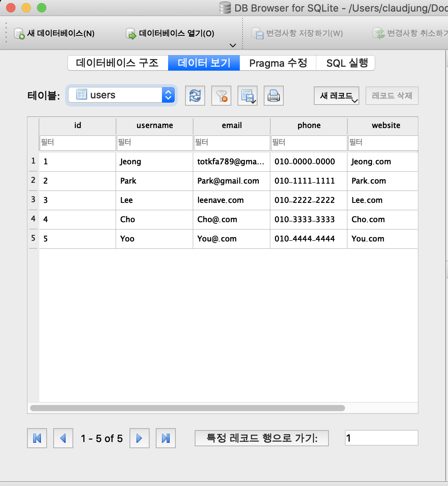

# SQlite - db 파일생성, 테이블 생성, 데이터 삽입

파이썬에서 데이터베이스 연동 하는데 기본적으로 내장되어 있는 SQlite를 사용하겠다.

## # sqlite3
```py
import sqlite3

print('sqlite3.verseion: ', sqlite3.version)
print('sqlite3.sqlite_version: ', sqlite3.sqlite_version)
```
```
sqlite3.verseion:  2.6.0
sqlite3.sqlite_version:  3.22.0
```

## # DB생성 (CONNECT)
DB를 생성 해보자.  
sqlite3 connect() 로 DB파일을 생성한다.  
```py
sqlite3.connet('(db파일 만들 디렉토리)/(생성할 db파일 이름).db')
```
다음과 같이 생성할 db이름과 생성될 디렉토리를 설정해주고 생성한다.
```py
conn = sqlite3.connect('/Users/claudjung/Documents/dev/python_basic/resource/database.db', isolation_level = None)
```
> ✔️ auto-commit  
> connect()의 isolation_level 옵션을 None으로 하면, auto-commit 설정이 된다. 따로 commit을 해줄 필요가 없다.

## # 테이블 생성 (CREATE)
db안에 저장할 데이터들의 테이블을 생성한다.  

### **cursor()**
cursor()는 데이터의 끝부분을 가리킨다.   
그러기 때문에 새로운 테이블을 생성해줄 때 cursor()로 데이터 끝부분을 가리키게 한 다음 생성해준다.

```py
c = conn.cursor()
```
### **execute()**
db파일의 cursor()로 끝부분을 잡았다면, execute()로 테이블 생성을 해본다.

### **테이블 생성**
테이블 이름: users  
항복: id(int값), username(text), email(text), phone(text), website(text), residate(text)
```py
c.execute("CREATE TABLE IF NOT EXISTS users(id INTEGER PRIMARY KEY, \
  username text, email text, phone text, website text, residate text)")
```

## # 데이터 삽입 (INSERT)
생성한 테이블에 데이터를 삽입 해본다.

residate 테이블에 들어갈 등록시간 데이터 구해놓기:
```py
# 테이블 residate 데이터 값 구해놓기
import datetime

# 삽입 날짜 생성
now = datetime.datetime.now()
print('now: ', now)

nowDatetime = now.strftime('%Y-%m-%d %H:%M:%S')
print('nowDatetime: ', nowDatetime)
```
명령어를 통해 생성한 테이블에 데이터를 삽입 해준다.  
데이터 삽입 1, 2는 형태가 조금 다를 뿐 데이터 삽입 방식!
```py
# 데이터 삽입 1
c.execute("INSERT INTO users VALUES(1, 'Jeong', 'totkfa789@gmail.com', '010-0000-0000', 'Jeong.com', ? )", (nowDatetime,))

# 데이터 삽입 2
c.execute("INSERT INTO users VALUES(1, 'Jeong', 'totkfa789@gmail.com', '010-0000-0000', 'Jeong.com', ? )", (nowDatetime,))

```

**많은 데이터 삽입**  

튜플이나 리스트 형태의 데이터들로 데이터를 삽입 할 수 있다.
```py
userList = (
  (3, 'Lee', 'leenave.com', '010-2222-2222', 'Lee.com', nowDatetime),
  (4, 'Cho', 'Cho@.com', '010-3333-3333', 'Cho.com', nowDatetime),
  (5, 'Yoo', 'You@.com', '010-4444-4444', 'You.com', nowDatetime)
)

c.executemany("INSERT INTO users(id, username, email, phone, website, residate) VALUES (?, ?, ?, ?, ?, ?)", userList)
```

## # DB Browser for SQLite
**db파일의 데이터들을 GUI 형태로 쉽게 확인** 할 수 있다.  
DB Browser for SQLite를 실행 시키고 방금 생성한 db파일을 선택하고 실행 시킨다.  
  
다음과 같이 db파일의 생성된 테이블과 삽입된 데이터 값들을 확인 할 수 있다.



## # 접속 해제 (CLOSE)
작업을 안한다면, 미래의 알 수 없는 문제를 일으키지 않게 하기 위해 접속을 종료해준다. 

```py
conn.close()
```


## # 키워드
  - sqlite3
    - connect()
      - isolation_level=None
    - cursor()
    - execute()
      - 테이블 생성
      - 테이블 삭제
      - 데이터 삽입
  - DB Browser for SQLite